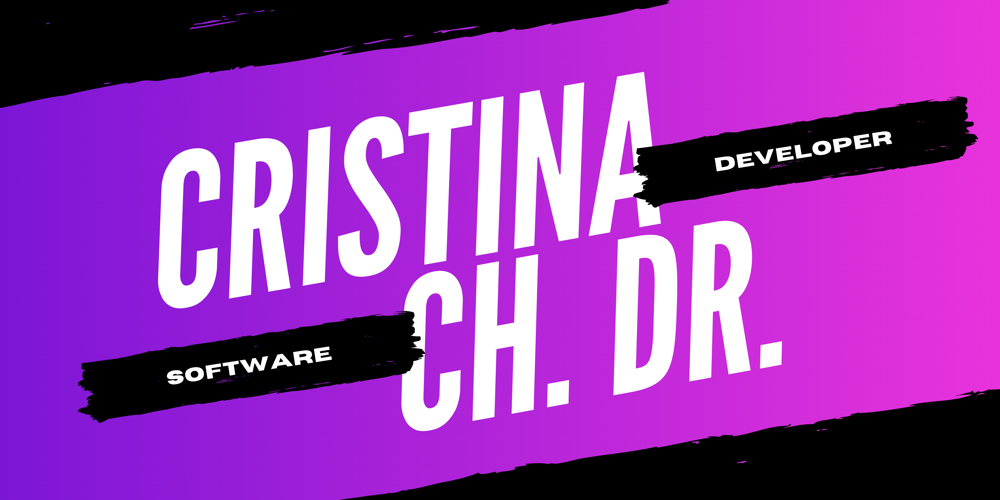

<h1 align="center">Hi 👋, I'm Cristina</h1>

I'm a student of Cross-platform Application Development from Spain.

I really enjoy learning new things .

- 📫 How to reach me cristinachvartatska@gmail.com

<h3 align="left">Languages and Tools:</h3>

 
   &emsp;
   &emsp;
   &emsp;
   &emsp;
   &emsp;
   &emsp;
   

